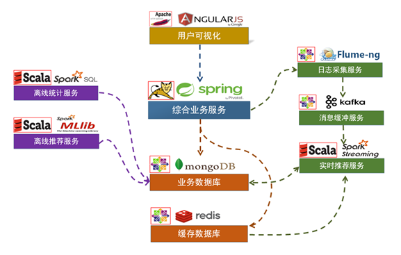
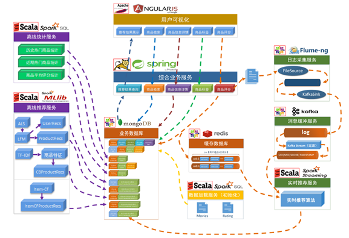
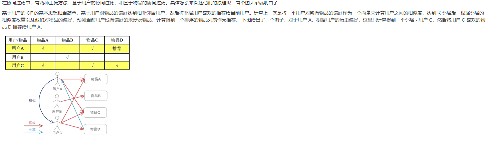
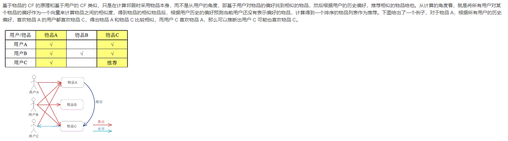

# EcommerceRecommendationSystem

### 用户可视化：
#### 主要实现和用户的交互以及业务数据的展示，主体采用AngularJS，部署在Apache上
### 综合业务服务
#### 实现JavaEE层面整体的业务逻辑，通过Spring进行构建，对接业务需求，部署在Tomcat上

### 数据存储部分
#### 业务数据库：采用广泛应用的文档数据库MongoDB作为主数据库，主要负责平台业务逻辑数据的存储

#### 缓存数据库：采用Redis作为缓存数据库，主要用来支撑实时推荐系统部分对数据的高速获取需求

### 离线推荐部分
#### 离线统计服务：批处理统计性业务采用Spark Core + Spark SQL进行实现对指标类数据的统计任务
#### 离线推荐服务： 离线推荐业务采用Spark Core + Spark MLlib 进行实现，采用ALS算法

### 实时推荐部分
#### 日志采集服务：利用Flume-ng对业务平台中用户对于商品的一次平分进行采集，实时发送到Kafka集群
#### 消息缓冲服务：采用Kafka作为流式数据的缓存组件，接受来自Flume的数据采集请求，并将数据推送到项目的实时推荐系统
#### 实时推荐服务：采用Spark Streaming作为实时推荐系统，接受Kafka中缓存数据，通过设计的推荐算法实现对实时推荐数据处理，并将结构合并更新到MongDB数据库

### ALS协同过滤算法
#### 收集数据 -- 找到相似用户和物品 -- 进行推荐
#### 找到相似用户和物品 --> 计算用户间以及商品间的相似度， 通过欧几里得距离，皮尔逊相似系数，Cosine相似度，Tanimoto相似度

